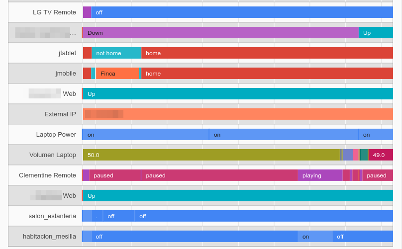

% Home Automation with Home Assistant
% {height=40 style=vertical-align:middle} jjmontes@gmail.com - {height=40 style=vertical-align:middle} jjmontesl
% PyDay Galicia 2017 (*CC BY-SA 3.0*)


# Home Automation

## Home Automation

Home Automation allows us to **control** \
and **automate** devices _at home_.

* Currently there is no standard for (home) IoT
* Different apps and clouds for each vendor
* Impossible to automate across boundaries

A Home Automation Hub connects to different devices and
manages events and commands across them.

## Applications

* Automate lighting and appliances based on presence, schedule, sun position...
* Wakeup alarms: lights, TV, music, blinds, coffee...
* Control heating using sensors, weather predictions, schedule or presence of family members.
* Alarm systems, presence detection, fake presence during holidays.
* Automate gardens using weather predictions and sensors (temperature, humidity...).
* Check if the car is low on fuel (set alarm 10 minutes earlier, send a notification).

# Home Assistant

## Home Assistant

{width=20%}

[https://home-assistant.io/](https://home-assistant.io/)

Home Assistant is an open-source home automation platform running on Python 3.
Track and control all devices at home and automate control. Perfect to run on a Raspberry Pi.

---

{width=100%}

---

{width=49%}
{width=49%}


## Devices

{style=float:right;margin-top:100px;width:33%;}

<div style="width: 65%; float: right;">
[600+ ready to use components](https://home-assistant.io/components/):

* Lights, switches, covers, fans, sensors
* Thermostates, cameras, alarms
* Media Players, TVs
* DIY: Arduino, GPIO...
* Weather, ITTT, API.AI, Voice, TTS
* Track things on a map
</div>


# Example

## Installing

Needs Python3. Using PIP:

```
python3 -m venv env
. env/bin/activate
pip install homeassistant
```

## Configuration

* Configuration is by default in the `~/.homeassistant` directory.
* Configuration is defined in YAML format.
* Configuration starts in the `configuration.yaml` file.

_Tips_:

* Fixed IP addresses (configure your router or DHCP server)
* Names for hosts (prepare to edit /etc/hosts where needed)
* Avoid monolithic config file: use [homeassistant packages](https://home-assistant.io/docs/configuration/packages/)

##

configuration.yaml

<div style="font-size: 75%;">
```yaml
# Main config
homeassistant:

  # Location required to calculate the time the sun rises and sets
  latitude: !secret home_lat
  longitude: !secret home_lon
  # Impacts weather/sunrise data (altitude above sea level in meters)
  elevation: 75

  # Units: metric for Metric, imperial for Imperial
  unit_system: metric

  # Timezone (from: http://en.wikipedia.org/wiki/List_of_tz_database_time_zones)
  time_zone: Europe/Madrid
```
</div>

---

<div style="font-size: 75%;">
```yaml
# Track the sun
sun:

# Enables the frontend
frontend:

# HTTP configuration
http:
  api_password: !secret api_password
  use_x_forwarded_for: True
  #base_url: !secret base_url
```
</div>

* component attributes are defined as a dictionary.
* `!secret` allows to define secrets in a separate file.

---

<div style="font-size: 75%;">
```yaml
# Zones
zone:

  - name: Home
    latitude: !secret home_lat
    longitude: !secret home_lon
    radius: 100
    icon: mdi:home

  - name: Work
    latitude: !secret work_lat
    longitude: !secret work_lon
    radius: 100
    icon: mdi:worker
```
</div>

Zones are used for device or user tracking.

## Running

Run homeassistant:

    . env/bin/activate
    hass -c configdir

Connect to:

[http://localhost:8123](http://localhost:8123)

## Devices: Sensors, Lights, Switches...

Add an item for each device to be controlled:

<div style="font-size: 75%;">
```yaml
switch:
  platform: command_line
  switches:
    kitchen_light:
      command_on: switch_command on kitchen
      command_off: switch_command off kitchen

sensor:
  - platform: command_line
    command: SENSOR_COMMAND
```
</div>

## Splitting configuration

You can split configuration per *platform* (switches, lights,  zones...).
However, using packages is recommended.

## More: Media Players, TVs...

## Grouping and presentation

# Automation

## Components

{style=float:right;width:50%;}

Components:

* Have state
* Trigger events
* Support actions

\
\
<div style="clear:both; font-size: 70%;">
_Component state can easily be inspected from the web interface._
</div>

## Architecture

{style=float:right;width:38%;}

<div style="width: 60%;">
* **Event Bus**
* **State Machine**: Fires state change events.
* **Service Registry**: Registry of actions on components (`light.turn_on`).
* **Timer**: Fires time change events.
</div>

## Automation

Ingredients of a HASS automation:

1. Events that trigger the automation
2. Conditions (optional)
3. Commands / actions to run

---

{style=float:right;width:100%;}

## Automation: Scripts

## Automation: Triggers

# Deployment

## Deployment Options (on rPi)

Some systems already include OpenZWave, \
MQTT Broker ([Mosquitto](https://mosquitto.org/)), HDMI-CEC for Raspberry Pi.

- Raspbian all-in-one ([fabric](http://www.fabfile.org/))
- Hassbian
- Docker
- Custom scripts

> Do not forget about SSL!

## A more complete example...

{width=70%}

# Custom components

## Custom components

Asd


# Final words...

## Pros and gotchas

Pros:

* Clean and useful frontend.
* Support for hundreds of devices.
* Free and Open Source.
* Runs on Raspberry Pi.
* Your data is not sent to third parties.

---

Gotchas:

* 3 configuration styles (per item, per platform, per package).
* Confusing typing of variables and states.
* Code is partly object oriented, config is platform oriented.
* Components inconsistent behavior, may cause race conditions.
* API and config is still changing.

## Future

* Not limited to *home*: greenhouses, workshops, customer premises, IoT.
* Privacy, security and availability considerations.
* Risk of loss of control (cloud services).

<aside class="notes">
    With the improvements in AI, a lot of tasks are now
    achievable. In the near future Google or Alexa will be able to pick
    up spoken instructions for automations. They might as well close
    their protocols and hamper interoperability.
</aside>

## References

* *Home Assistant*: [https://home-assistant.io/]()
* *This talk*: [https://github.com/jjmontesl/talk-hass-pydaygalicia2017]()
* *My config*: [https://github.com/jjmontesl/home-assistant-config]()

* [Development intro talk by Paulus Schoutsen](https://www.youtube.com/watch?v=Cfasc9EgbMU)

## Q&A ?

Thanks!

